# IKAROS Workspace — Architecture Overview

A high-level component map of `ikrs-workspace`. Click any node in
the rendered diagram below (GitHub renders the `mermaid` block) to
jump straight to the corresponding source folder on `main`.

For deep dives on specific layers (identity, Firestore schema,
secrets, operational runbooks, integration coverage, phase status),
the canonical reference is **[ECOSYSTEM.md](./ECOSYSTEM.md)**.

## Component map

```mermaid
flowchart TD

subgraph group_desktop["Desktop app"]
  node_ui_shell["UI shell<br/>React desktop shell<br/>[App.tsx]"]
  node_layout_frame["Layout frame<br/>Shell layout"]
  node_feature_views["Work views<br/>Workspace views"]
  node_ui_state["UI stores<br/>Zustand state"]
  node_ui_hooks["Bridge hooks<br/>React hooks"]
  node_assistant_panels["Assistant panels<br/>Feature widgets"]
  node_react_bridge["Bridge libs<br/>Frontend integration"]
end

subgraph group_backend["Rust backend"]
  node_command_api["Command API<br/>Tauri commands"]
  node_claude_runtime["Claude runtime<br/>Subprocess orchestration"]
  node_mcp_wiring["MCP wiring<br/>Tool config<br/>[mcp_config.rs]"]
  node_oauth_identity["Auth layer<br/>OAuth + identity"]
  node_sync_storage["Sync + storage<br/>Filesystem/remote sync<br/>[vault.rs]"]
  node_skills_memory["Skills + memory<br/>Assistant workflow layer"]
end

subgraph group_heartbeat["Heartbeat service"]
  node_heartbeat_app["Heartbeat app<br/>Python service"]
  node_heartbeat_signals["Signal collectors<br/>Heartbeat inputs"]
  node_heartbeat_outputs["Signal outputs<br/>Heartbeat outputs"]
end

subgraph group_ops["Operations memory"]
  node_workspace_files["Workspace files<br/>Local content"]
end

subgraph group_external["External systems"]
  node_firebase_firestore[("Firebase/Firestore<br/>Remote metadata")]
  node_google_apis[("Google APIs<br/>Workspace integrations")]
  node_os_boundaries["OS boundaries<br/>Desktop platform"]
end

node_ui_shell -->|"frames"| node_layout_frame
node_ui_shell -->|"routes to"| node_feature_views
node_ui_shell -->|"reads state"| node_ui_state
node_ui_shell -->|"uses hooks"| node_ui_hooks
node_feature_views -->|"shows panels"| node_assistant_panels
node_ui_hooks -->|"calls"| node_react_bridge
node_react_bridge -->|"invokes"| node_command_api
node_ui_state -->|"streams"| node_claude_runtime
node_command_api -->|"controls"| node_claude_runtime
node_claude_runtime -->|"loads tools"| node_mcp_wiring
node_mcp_wiring -->|"binds to"| node_google_apis
node_command_api -->|"authenticates"| node_oauth_identity
node_oauth_identity -->|"syncs identity"| node_firebase_firestore
node_oauth_identity -->|"uses keychain"| node_os_boundaries
node_command_api -->|"syncs data"| node_sync_storage
node_sync_storage -->|"writes metadata"| node_firebase_firestore
node_sync_storage -->|"syncs services"| node_google_apis
node_sync_storage -->|"accesses files"| node_os_boundaries
node_command_api -->|"executes"| node_skills_memory
node_skills_memory -->|"reads/writes"| node_workspace_files
node_heartbeat_app -->|"collects"| node_heartbeat_signals
node_heartbeat_app -->|"dispatches"| node_heartbeat_outputs
node_heartbeat_signals -->|"reads"| node_google_apis
node_heartbeat_signals -->|"reads tokens"| node_firebase_firestore
node_heartbeat_outputs -->|"publishes"| node_firebase_firestore
node_heartbeat_outputs -->|"uses secrets"| node_os_boundaries
node_heartbeat_outputs -->|"logs context"| node_workspace_files

click node_ui_shell "https://github.com/ikarosgit/ikrs-workspace/blob/main/src/App.tsx"
click node_layout_frame "https://github.com/ikarosgit/ikrs-workspace/tree/main/src/components/layout"
click node_feature_views "https://github.com/ikarosgit/ikrs-workspace/tree/main/src/views"
click node_ui_state "https://github.com/ikarosgit/ikrs-workspace/tree/main/src/stores"
click node_ui_hooks "https://github.com/ikarosgit/ikrs-workspace/tree/main/src/hooks"
click node_assistant_panels "https://github.com/ikarosgit/ikrs-workspace/tree/main/src/components"
click node_command_api "https://github.com/ikarosgit/ikrs-workspace/tree/main/src-tauri/src/commands"
click node_claude_runtime "https://github.com/ikarosgit/ikrs-workspace/tree/main/src-tauri/src/claude"
click node_mcp_wiring "https://github.com/ikarosgit/ikrs-workspace/blob/main/src-tauri/src/claude/mcp_config.rs"
click node_oauth_identity "https://github.com/ikarosgit/ikrs-workspace/tree/main/src-tauri/src/oauth"
click node_sync_storage "https://github.com/ikarosgit/ikrs-workspace/blob/main/src-tauri/src/commands/vault.rs"
click node_skills_memory "https://github.com/ikarosgit/ikrs-workspace/tree/main/src-tauri/src/skills"
click node_react_bridge "https://github.com/ikarosgit/ikrs-workspace/tree/main/src/lib"
click node_workspace_files "https://github.com/ikarosgit/ikrs-workspace/tree/main/operations"
click node_heartbeat_app "https://github.com/ikarosgit/ikrs-workspace/tree/main/heartbeat/src/heartbeat"
click node_heartbeat_signals "https://github.com/ikarosgit/ikrs-workspace/tree/main/heartbeat/src/heartbeat/signals"
click node_heartbeat_outputs "https://github.com/ikarosgit/ikrs-workspace/tree/main/heartbeat/src/heartbeat/outputs"

classDef toneNeutral fill:#f8fafc,stroke:#334155,stroke-width:1.5px,color:#0f172a
classDef toneBlue fill:#dbeafe,stroke:#2563eb,stroke-width:1.5px,color:#172554
classDef toneAmber fill:#fef3c7,stroke:#d97706,stroke-width:1.5px,color:#78350f
classDef toneMint fill:#dcfce7,stroke:#16a34a,stroke-width:1.5px,color:#14532d
classDef toneRose fill:#ffe4e6,stroke:#e11d48,stroke-width:1.5px,color:#881337
classDef toneIndigo fill:#e0e7ff,stroke:#4f46e5,stroke-width:1.5px,color:#312e81
classDef toneTeal fill:#ccfbf1,stroke:#0f766e,stroke-width:1.5px,color:#134e4a
class node_ui_shell,node_layout_frame,node_feature_views,node_ui_state,node_ui_hooks,node_assistant_panels,node_react_bridge toneBlue
class node_command_api,node_claude_runtime,node_mcp_wiring,node_oauth_identity,node_sync_storage,node_skills_memory toneAmber
class node_heartbeat_app,node_heartbeat_signals,node_heartbeat_outputs toneMint
class node_workspace_files toneRose
class node_firebase_firestore,node_google_apis,node_os_boundaries toneIndigo
```

## Legend

- 🟦 **Desktop app** — React UI rendered inside the Tauri webview.
- 🟧 **Rust backend** — Tauri commands, Claude subprocess orchestration, MCP wiring, OAuth, sync/storage, skills/memory.
- 🟩 **Heartbeat service** — autonomous Python service on the VM (Tier II); Tier I in-app equivalent lives inside the Rust block.
- 🟥 **Operations memory** — workspace files / vault content on disk.
- 🟪 **External systems** — Firebase/Firestore, Google APIs, OS-level boundaries (keychain, services).

The Tier I (in-Tauri) ↔ Tier II (on-VM) split, Firestore schema,
secrets posture, runbooks, and phase status all live in
[ECOSYSTEM.md](./ECOSYSTEM.md).
